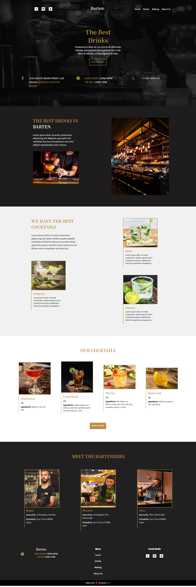

# Frontend Mentor - Todo app solution

This is a solution to the [Todo app challenge on Frontend Mentor](https://www.frontendmentor.io/challenges/todo-app-Su1_KokOW). Frontend Mentor challenges help you improve your coding skills by building realistic projects. 

## Table of contents

- [Frontend Mentor - Todo app solution](#frontend-mentor---todo-app-solution)
  - [Table of contents](#table-of-contents)
  - [Overview](#overview)
    - [What The Web Should Do](#what-the-web-should-do)
    - [Screenshot](#screenshot)
    - [Links](#links)
  - [My process](#my-process)
    - [Built with](#built-with)
    - [What I learned](#what-i-learned)
  - [Author](#author)

**Note: Delete this note and update the table of contents based on what sections you keep.**

## Overview

### What The Web Should Do

Users should be able to:

- Make requests to the api of [The CocktailDB](https://www.thecocktaildb.com/api.php)
- Create a search box for the drinks that the bar has
  - Search by ingredient, name and first letter
  - Filter beverages by alcohol, category and glass
  - Search for beverages indicating which ingredients to avoid
- Display beverages with their name, price and description/ingredients
- Show a modal with more information about the drinks

### Screenshot




### Links

- GitHub URL: [Add solution URL here](https://github.com/deividcode/barten)
- GitHub Page URL: [Add live site URL here](https://deividcode.github.io/barten/)

## My process

### Built with
- Design
  - Semantic HTML5 markup
  - CSS custom properties
  - Mobile-first workflow  
  - PostCss

### What I learned

Use this section to recap over some of your major learnings while working through this project. Writing these out and providing code samples of areas you want to highlight is a great way to reinforce your own knowledge.

To see how you can add code snippets, see below:


```js
// Config Postcss
export default {
  "plugins": {
    "@fullhuman/postcss-purgecss": {
      content: ["./index.html"],
      css: ["./src/postcss/*.pcss"]
    },   
    "postcss-extend": {},
    "postcss-nested": {},
    "autoprefixer": {},
    "postcss-color-rgba-fallback": {},    
  },
}
```


## Author

- GitHube - [deividcode](https://github.com/deividcode)
- Twitter - [@deividCoder](https://twitter.com/deividCoder)
  